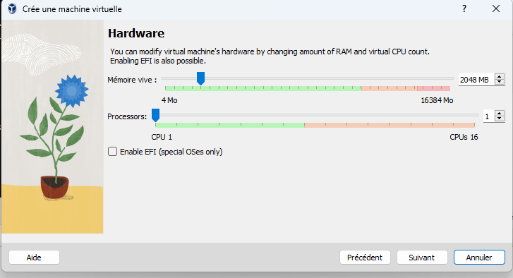
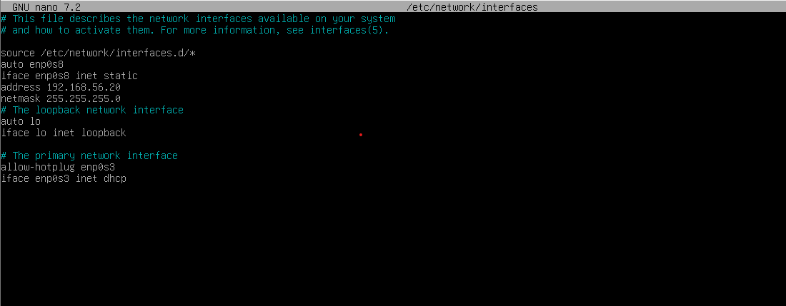

# Documation SQL
### Cette documation vous permettra de pouvoir
* Installation en toute autonomie d'un serveur avec le SGBD MariaDB 
* Créer une base de données 
* Importer une structure et données à partir d'un script SQL déja réaliser 

### 1 - Installation Serveur 

Avant d’installer le SGBD, il est nécessaire d’installer un serveur avec un système 
l’exploitation. Le serveur sera une machine virtuelle VirtualBox.

# Installation de l'image ISO 

Lorsque vous souhaitez installer un nouveau système d’exploitation sur une VM VirtualBox, il est nécessaire dans la plupart des cas d’utiliser un fichier d’image disque au format ISO.

l'image que nous souhaintons installer se trouve sur ce site -> https://www.debian.org/CD/netinst/

  --installer l'mages de CD d'installation par le réseau amd64-- 

  apres voir installer l'image ISO rendu sur virtulbox

# Création de la machine virtuel

une fois sur Oracle VM VirtualBox vous aller aller dans nouvelle 

ensuite vous aller donner un nom a la machine virtuel puis dans ISO image vous aller rechercher l'image ISO installer presedament 

<strong> cocher la case Skip Unattended Installation </strong>

ensuite apres avoir appuyer sur suivant faite en sorte d'avoir les mêmes informations que sur les images (les images sont dans l'ordre du procésus)

l'instalation de la machine virtuel est maintenant terminer.

# Configuration de la machine virtuel 

Maintenant nous allons configurer la debian

Démarer la machien virtuel en cliquant sur démarrer

On arrive alors sur le menu de démarrage Debian.
Choisissez Advanced option. nous allons configurer la machine 

ensuite Expert Intall 

ensuite faite l'installation de base en choissiant les intalation cque vous prefere 

## Arriver sur le menu principale du programme d'installation Debian 

vous aller détecter le materiel réseau. ensuite vous aller configuerer le reseau 

appuiyer sur oui pour le serveur dhcp 

puis ensuite choissisez un nom pour la machine et un nom de domaine

ensuite vous allez créer les utilisateur et choisir les mots de passe

cliquer nan pour le root 

ensuite crée un utilisateur operateur 
et choisir son mot de passe par exemple P@ssw0rd

ensuite vous pouvez directement selctionner Intsaller le programme de démarrage grub
il vous sera demander la methode de pârtitionnement vou schoisissez Assiteé - utiliser un disque entier 

ensuite cliquer sur oui 

enusite vous aller installer le noyau linux-image-amd64 

ensuite vous selectionner l'image générique 

ensuite non
 ensuite oui pour que le systeme d'exploitation soit installer sur la vm ensuite 
selectionner cette case en rouge 

ensuite vous pouivez terminer l'installation 

# faire le truc pour les reseaux

faite un sudo ifdown enp0s8 && ifup enp0s8
ensuite faite la commande sudo nano /etc/network/interfaces  et noter comme l'image si dessous 

vous etes desomais sur une autre adresse ip et vous pouver aller sur internet.
par exemple faite un ping 8.8.8.8

# installation de ssh 

sudo apt update 
sudo apt install openssh-server -y si le ssh dit qu'il a un probleme 
aller dans sudo nano /etc/apt/sources.list ou on notera 

ensuite vous aller faire la commande deb:http//deb.debian.org/debian bookworm main non-free-firmware

remettre a jour 
et refaite la commande install openssh-serbver

voila 

ensuite sur votre machine a vous, aller sur cmd est connecter vous a votre ssh 

cela permet d'avoir acces a votre debian depuis votre windows

# instalaltion de mariadb 

ensuite nous allons installer mariadb 

mettre les commande 

pour la securisation 
operateur@debian:/etc$ sudo mysql_secure_installation                                                                                                                                                                                           NOTE: RUNNING ALL PARTS OF THIS SCRIPT IS RECOMMENDED FOR ALL MariaDB                                                         SERVERS IN PRODUCTION USE!  PLEASE READ EACH STEP CAREFULLY!                                                                                                                                                                              In order to log into MariaDB to secure it, we'll need the current                                                       password for the root user. If you've just installed MariaDB, and                                                       haven't set the root password yet, you should just press enter here.                                                                                                                                                                            Enter current password for root (enter for none):                                                                       OK, successfully used password, moving on...                                                                                                                                                                                                    Setting the root password or using the unix_socket ensures that nobody                                                  can log into the MariaDB root user without the proper authorisation.                                                                                                                                                                            You already have your root account protected, so you can safely answer 'n'.                                                                                                                                                                     Switch to unix_socket authentication [Y/n] Y                                                                            Enabled successfully!                                                                                                   Reloading privilege tables..                                                                                             ... Success!                                                                                                                                                                                                                                                                                                                                                           You already have your root account protected, so you can safely answer 'n'.                                                                                                                                                                     Change the root password? [Y/n] Y                                                                                       New password:                                                                                                           Re-enter new password:                                                                                                  Password updated successfully!                                                                                          Reloading privilege tables..                                                                                             ... Success!                                                                                                                                                                                                                                                                                                                                                           By default, a MariaDB installation has an anonymous user, allowing anyone                                               to log into MariaDB without having to have a user account created for                                                   them.  This is intended only for testing, and to make the installation                                                  go a bit smoother.  You should remove them before moving into a                                                         production environment.                                                                                                                                                                                                                         Remove anonymous users? [Y/n] Y                                                                                          ... Success!                                                                                                                                                                                                                                   Normally, root should only be allowed to connect from 'localhost'.  This                                                ensures that someone cannot guess at the root password from the network.                                                                                                                                                                        Disallow root login remotely? [Y/n] Y                                                                                    ... Success!                                                                                                                                                                                                                                   By default, MariaDB comes with a database named 'test' that anyone can                                                  access.  This is also intended only for testing, and should be removed                                                  before moving into a production environment.                                                                                                                                                                                                    Remove test database and access to it? [Y/n] n                                                                           ... skipping.                                                                                                                                                                                                                                  Reloading the privilege tables will ensure that all changes made so far                                                 will take effect immediately.                                                                                                                                                                                                                   Reload privilege tables now? [Y/n] Y                                                                                     ... Success!                                                                                                                                                                                                                                   Cleaning up...                                                                                                                                                                                                                                  All done!  If you've completed all of the above steps, your MariaDB                                                     installation should now be secure.                                                                                                                                                   sudo nano /etc/mysql/mariadb.conf.d/50-server.cnf                                                           Thanks for using MariaDB! 
https://www.it-connect.fr/comprendre-les-differents-types-de-reseaux-virtualbox/

ensuite nous allons apporter les modif de mariadb 

creons une base de donnée 
create database rpgquest;    
puis entrer dans la base avec la commande use rpsquest 
ensuite creer ces tables 
 avec les tables TC2 - TP - Installation SGBD - RPGQuest.sql
 ou alors faite une intsallation du ficher eet un source RPGQUEST.sql

ensuite nous allons donner les droit a l'utilisateur operateur afin de pouvoir réaliser des operation de maintenance puis se creer un utilisateur application avoir accès qu’aux données 
en lecture écriture.

reouvrer mysql 
CREATE USER 'application'@'%' IDENTIFIED BY 'password_application';
GRANT SELECT, INSERT, UPDATE, DELETE ON nom_base.* TO 'application'@'%';
puis donnons les droit necassaire a application 
GRANT SELECT ON nom_base.* TO 'application'@'%';

puis ensuite pour verifier les permissions faite un 

SHOW GRANTS FOR 'operateur'@'%';
SHOW GRANTS FOR 'application'@'%';

voici une matrice des droit que les utilisateur pourront faire 

ensuite vous pouvez vous connectez sur Mysql Workbench 
remplissez comme ceci: 

et vous aurez acces a toute les tables de la abse comme les tables on etait crée su rmaria db 

installer le grub sinon pas d'interface

