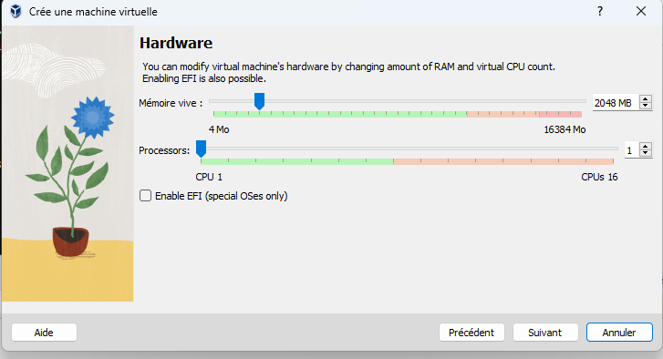
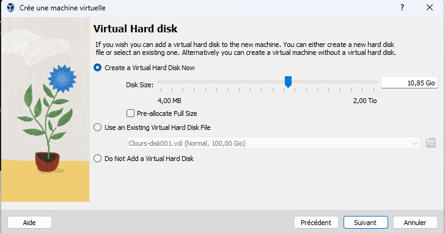
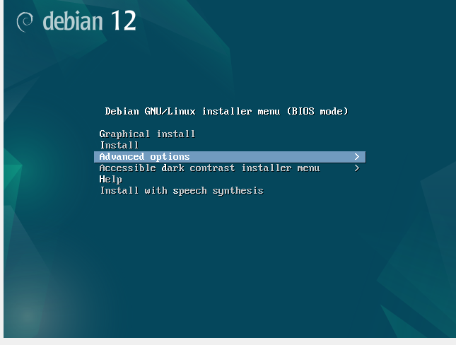
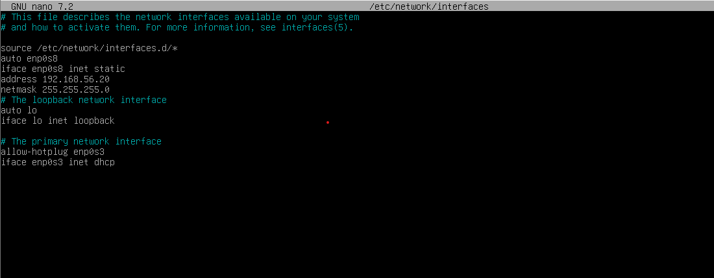
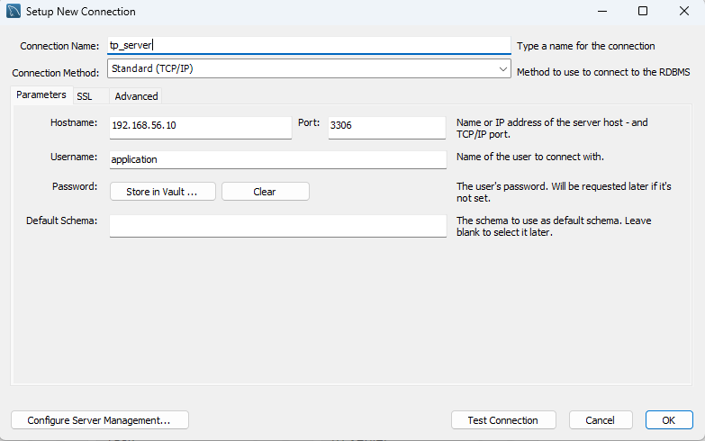
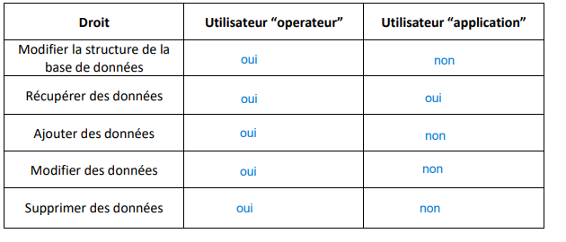

# Documentation SQL

## Objectifs
Cette documentation vous permettra de :
1. Installer un serveur avec le SGBD **MariaDB**.
2. Créer une base de données.
3. Importer une structure et des données à partir d’un script SQL existant.


## 1. Installation du Serveur

### Prérequis
Vous aurez besoin d’un système d’exploitation sur une machine virtuelle (VM) via **VirtualBox** et d’un fichier ISO Debian. Téléchargez l’image ISO [ici](https://www.debian.org/CD/netinst/) : 
- **Image recommandée** : CD d'installation par le réseau (amd64).


### Étapes d'installation

#### a) Création de la machine virtuelle
1. Ouvrez **Oracle VM VirtualBox**.
2. Cliquez sur **Nouvelle** et configurez :
   - **Nom de la VM** : Choisissez un nom.
   - **Image ISO** : Importez l’image ISO téléchargée.
   - **Options importantes** : 
     - Cochez la case **Skip Unattended Installation**.
3. Suivez les étapes de configuration comme indiqué dans les images ci-dessous :
   - Configuration générale.
   
   - Allocation de ressources.
   

4. Lancez l’installation.


#### b) Configuration de Debian
1. Démarrez la VM.
2. Sélectionnez **Advanced Options > Expert Install**.
3. Suivez ces étapes principales :
   - **Réseau** : Configurez via DHCP.
   - **Nom de la machine** : Définissez un nom et un domaine.
   - **Utilisateurs** :
     - Pas de mot de passe root (sélectionnez "Non").
     - Créez un utilisateur, par exemple : **operateur**, mot de passe : `P@ssw0rd`.
   - **Partitionnement** : Choisissez "Assisté - Utiliser un disque entier".
   - **Grub** : Installez le programme de démarrage GRUB.

   

4. Terminez l'installation et redémarrez la machine.


#### c) Configuration réseau
1. Configurez l'interface réseau :
   ```bash
   sudo ifdown enp0s8 && sudo ifup enp0s8
   sudo nano /etc/network/interfaces
   ```
   Modifiez le fichier comme indiqué :
   

2. Testez la connexion Internet avec :
   ```bash
   ping 8.8.8.8
   ```


#### d) Installation de SSH
1. Mettez à jour le système et installez le serveur SSH :
   ```bash
   sudo apt update
   sudo apt install openssh-server -y
   ```
2. Si des erreurs apparaissent, modifiez le fichier **sources.list** :
   ```bash
   sudo nano /etc/apt/sources.list
   ```
   Ajoutez :
   ```
   deb http://deb.debian.org/debian bookworm main non-free-firmware
   ```
   Puis relancez la mise à jour et réinstallez SSH.

3. Connectez-vous à la VM depuis votre machine via **CMD** :
   ```bash
   ssh operateur@192.168.56.10
   ```


## 2. Installation de MariaDB
1. Installez MariaDB :
   ```bash
   sudo apt install mariadb-server -y
   ```
2. Sécurisez l’installation avec :
   ```bash
   sudo mysql_secure_installation
   ```
   Suivez les recommandations (désactiver l’accès root à distance, supprimer les utilisateurs anonymes, etc.).

3. Configurez le fichier MariaDB :
   ```bash
   sudo nano /etc/mysql/mariadb.conf.d/50-server.cnf
   ```
   Faites les ajustements nécessaires pour la sécurité et la performance.


## 3. Création et Configuration de la Base de Données

### a) Création d’une base
1. Connectez-vous à MariaDB :
   ```bash
   sudo mysql -u root -p
   ```
2. Créez une base de données :
   ```sql
   CREATE DATABASE rpgquest;
   USE rpgquest;
   ```

3. Importez la structure et les données via un script SQL déja fourni:
   ```sql
   SOURCE RPGQUEST.sql;
   ```


### b) Gestion des utilisateurs
1. Créez un utilisateur pour la maintenance :
   ```sql
   CREATE USER 'operateur'@'192.168.56.10' IDENTIFIED BY 'password_operateur';
   GRANT ALL PRIVILEGES ON rpgquest.* TO 'operateur'@'%';
   ```
2. Créez un utilisateur pour l’application avec des droits limités :
   ```sql
   CREATE USER 'application'@'%' IDENTIFIED BY 'password_application';
   GRANT SELECT ON rpgquest.* TO 'application'@'%';
   ```

3. Vérifiez les permissions :
   ```sql
   SHOW GRANTS FOR 'operateur'@'%';
   SHOW GRANTS FOR 'application'@'%';
   ```


## 4. Connexion via MySQL Workbench
1. Téléchargez et installez **MySQL Workbench**.
2. Configurez une connexion avec les paramètres suivants :
   - **Nom d’utilisateur** : `application`.
   - **Mot de passe** : `password_application`.
   - **Base** : `rpgquest`.
   

3. Vous aurez accès à toutes les tables de la base.


## 5. Matrice des droits utilisateurs
Voici un résumé des permissions pour chaque utilisateur :




---